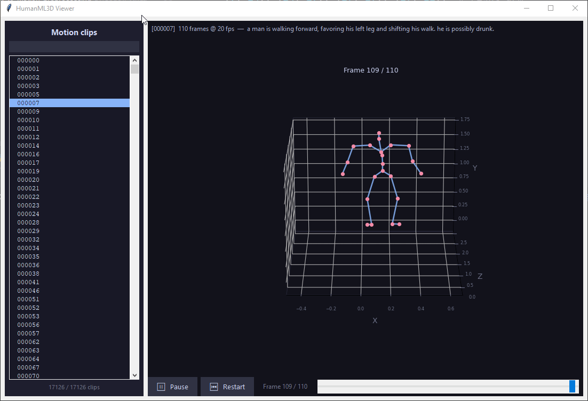

# Text-to-Motion Preprocessing

Bachelor's Diploma thesis project on **Text-to-Motion generation** using the
[HumanML3D](https://github.com/EricGuo5513/HumanML3D) dataset —
*"Generating Diverse and Natural 3D Human Motions from Text"*, Guo et al., CVPR 2022.

---

## Animation Viewer

A desktop tool for browsing and previewing motion clips from the dataset.



### Contents — `viewer/`

| File | Description |
|------|-------------|
| `viewer/__main__.py` | Entry point and full application — Tkinter UI, matplotlib 3D renderer, clip loader |

### Running

```bash
python -m viewer
```

### Features

- Scrollable list of all ~29 k motion clips with a live search/filter box
- 3D skeleton animation rendered at 20 fps using the SMPL 22-joint hierarchy
- Initial camera set to a front view (XZ floor, Y height) on every clip load; free rotation with the mouse during playback
- Play / Pause, Restart, and a frame scrubber slider
- First text annotation for the selected clip shown above the canvas
