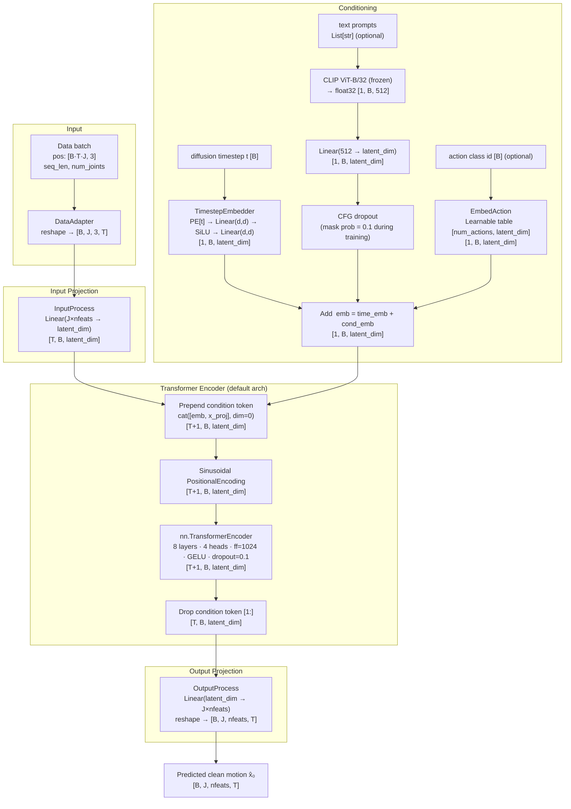
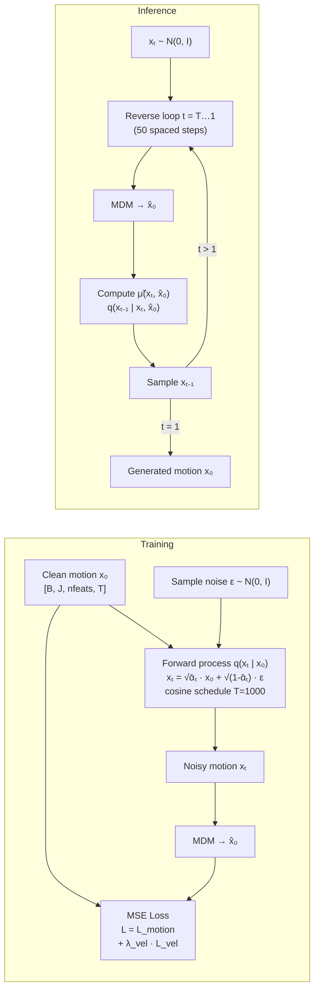
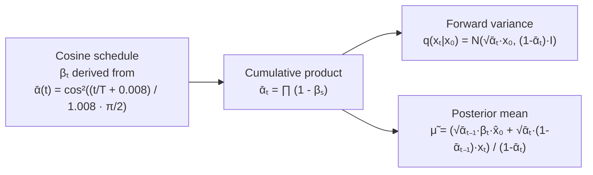

# Human Motion Diffusion Model (MDM)

Implementation based on [*Human Motion Diffusion Model*](https://arxiv.org/abs/2209.14916) (Tevet et al., ICLR 2023) and the [official repository](https://github.com/GuyTevet/motion-diffusion-model).

---

## Data Format

The model consumes `torch_geometric.data.Data` objects as produced by `src/graph_heatmaps.py`:

```
Data(
  pos:       Tensor[T×J, 3]   # flattened XYZ joint positions
  seq_len:   int              # T — number of frames
  num_joints: int             # J — number of joints (22 for HumanML3D)
)
```

Before entering the model the batch is reshaped to `[B, J, 3, T]` (batch × joints × features × frames), which is the canonical MDM tensor layout.

For HumanML3D:  **J = 22, nfeats = 3, data_rep = `xyz`**

---

## Architecture Overview

### 1. MDM Denoiser (Transformer)



---

### 2. Gaussian Diffusion Wrapper



---

### 3. Noise Schedule



---

## Module Reference

| Module | Class | Description |
|--------|-------|-------------|
| Data adapter | `MotionDataAdapter` | Converts `Data` batch list → `[B, J, nfeats, T]` tensor with padding mask |
| Input projection | `InputProcess` | `Linear(J·nfeats → latent_dim)` for `xyz` / `rot6d`; separate velocity projection for `rot_vel` |
| Timestep embedding | `TimestepEmbedder` | Indexes sinusoidal PE at step `t`, passes through 2-layer MLP with SiLU |
| Positional encoding | `PositionalEncoding` | Standard sinusoidal PE, max_len=5000 |
| Text encoder | CLIP `ViT-B/32` | Frozen; converts text → 512-dim float; projected to `latent_dim` |
| Action encoder | `EmbedAction` | Learnable embedding table `[num_actions, latent_dim]` |
| CFG masking | `mask_cond` | Zeros out condition with probability `cond_mask_prob` during training |
| Transformer | `nn.TransformerEncoder` | 8 × `TransformerEncoderLayer`; condition token prepended to sequence |
| Output projection | `OutputProcess` | `Linear(latent_dim → J·nfeats)` → reshape `[B, J, nfeats, T]` |
| Diffusion | `GaussianDiffusion` | Cosine schedule, predict-x₀ objective, MSE + velocity loss |

---

## Hyperparameters

### Model

| Parameter | Value | Notes |
|-----------|-------|-------|
| `latent_dim` | 512 | d_model of the Transformer |
| `ff_size` | 1024 | Feed-forward hidden dim |
| `num_layers` | 8 | Transformer encoder layers |
| `num_heads` | 4 | Attention heads |
| `dropout` | 0.1 | Applied in attention, FFN, and PE |
| `activation` | GELU | FFN activation |
| `arch` | `trans_enc` | Transformer Encoder (default) |
| `clip_version` | `ViT-B/32` | Frozen CLIP model |
| `clip_dim` | 512 | CLIP embedding dimension |
| `cond_mask_prob` | 0.1 | Classifier-free guidance dropout |

### Diffusion

| Parameter | Value | Notes |
|-----------|-------|-------|
| `diffusion_steps` | 1000 | Training timesteps |
| `noise_schedule` | `cosine` | |
| `predict_xstart` | `True` | Model predicts x₀, not ε |
| `learn_sigma` | `False` | Fixed variance |
| `sigma_small` | `True` | Use `FIXED_SMALL` posterior variance |
| Inference steps | 50 | Spaced from 1000 via `SpacedDiffusion` |

### Loss

| Term | λ | Description |
|------|---|-------------|
| `L_motion` | 1.0 | MSE on predicted x₀ vs. ground truth (masked) |
| `L_vel` | 0.5 (humanml) | MSE on finite-difference velocities |
| `L_rcxyz` | 0.0 | MSE on SMPL 3D positions (requires SMPL) |
| `L_foot_contact` | 0.0 | Foot-contact consistency at joints 7,8,10,11 |

---

## Input / Output Summary

```
Input  (per forward pass):
  x          : Tensor[B, J, nfeats, T]   — noisy motion at step t
  timesteps  : Tensor[B]                 — diffusion step indices
  y['text']  : List[str]  (optional)     — text conditions
  y['action']: Tensor[B]  (optional)     — action class indices
  y['mask']  : Tensor[B,1,1,T]           — valid-frame boolean mask

Output:
  x̂₀         : Tensor[B, J, nfeats, T]   — predicted clean motion
```

For this project's Data objects: **B = batch, J = 22, nfeats = 3, T ≤ 196**.
